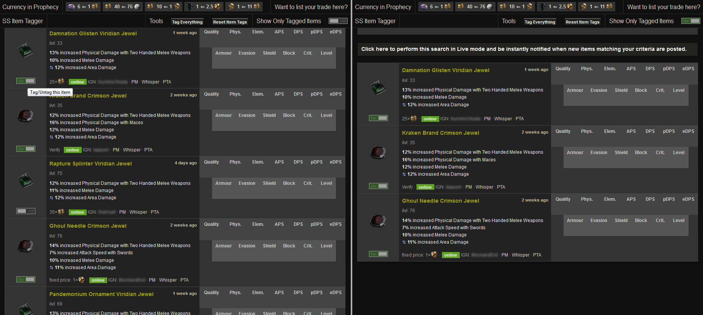

Smart Shopper Item Tagger Userscript
======================================

Ever felt annoyed by the amount of scrolling you have to do on poe.trade to compare specific items in search results? I did. I thought it would be nice to manually pick which items to show.  

This userscript provides a handy way to shortlist/filter search results on [poe.trade](poe.trade). In your search results page, you can tag interesting items and turn filtering on to hide everything else for easy item comparison.

Another nice way you could use it is to **Tag Everything** with one click from the top bar, and **Show Only Tagged Items**. Then you can **untag** individual items to make them disappear from the list leaving you with only the items you're interested in comparing and/or contacting their sellers.

I only tested this script on Firefox 44. It should work just fine on Chrome but I haven't tested it myself.

Usage
-------
This is a User Script. You need to add it to your [Greasemonky](https://addons.mozilla.org/en-US/firefox/addon/greasemonkey/) for Firefox or a similar plug-in for your browser.

Installation
------------
Open [the script](https://github.com/concacid/PoE-SSItemTagger/raw/master/PoESSItemTagger.user.js) in your browser and you should get the install prompt from your user script handling plug-in.
